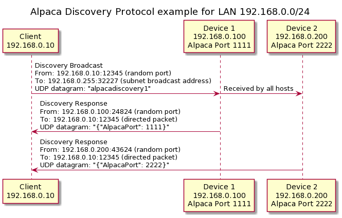

# Alpaca LAN Discovery Tests

This is documentation and sample test implementations for the new ASCOM Alpaca discovery protocol. This enables clients to find Alpaca devices within a Local Area Network (LAN). It is based on UDP and is designed to be as light weight and easy to implement as possible. It uses a known broadcast port and a known message / response. All information about the devices can then be retrieved via the management API.

For the following document Device will refer to something (a driver or device) that exposes the Alpaca interface and Client will refer to client applications that want to locate and use the Device's API(s).  

In order to implement this protocol all a Client needs is the ability to send a UDP broadcast and be able to receive a direct response. All the Device needs to be able to do is to receive broadcast UDP messages and to respond directly to the message. See below for a more formal specification.

 Once the IP Address and Alpaca port of the Device is known the Client can use the management API to query the Device and discover its supported endpoints and functions.

 For testing this uses port 32227 for the broadcasts and multicasts.

# Examples

This repository contains examples for several platforms and languages of both the Client and Device protocol. Both the Client and the Device protocol are designed to run on microcontrollers, any OS, or any language that offers UDP features. 

All of these examples have been tested on a variety of networks and operating systems and have consistently worked. If anyone finds differently please let me know. Note, before claiming that these don't work please make sure that you have a valid network route between your devices and that no firewall can interfere. This is designed to work on a given LAN, if your network consists of several LANs then it will likely not be able to cross the boundaries.

Note that this is a UDP protocol, packets can be lost or dropped. If you can't find a Device try sending the request again.

## Arduino
A set of examples that run on several different microcontrollers using the Arduino libraries and IDE. In addition I plan to add examples for additional microcontroller stacks as well as additional microcontrollers.

### ESP32

This is an example of the Device protocol (IPv4 only) that runs on the Espressif ESP32 chip using the arduino-esp32. Currently it has been tested on the Adafruit Feather HUZZAH32 (https://www.adafruit.com/product/3405), the Lolin D32 Pro, and the ESP32-DevKitC. It also uses the Arduino Libraries and IDE.

After this is flashed on a board it will print any received requests via the board serial port and respond to the Client with the response message. You can view the serial data through the Arduino Serial Monitor.

### ESP8266

This is an example of the Device protocol (IPv4 only) that runs on several ESP8266 boards. I have tested this on the Adafruit Feather Huzzah 8266 (https://www.adafruit.com/product/2821) and on a generic NodeMCU 1.0 ESP12-E (mine was made by LoLin and was version 3.0). It uses the Arduino Libraries and IDE (https://www.arduino.cc/en/main/software). You can follow the normal method of adding support for the ESP8266 (Adafruit has a good tutorial). Make sure to set your SSID and Password in the arduino_secrets file.

After this is flashed on a board it will print any received requests via the board serial port and respond to the Client with the response message. You can view the serial data through the Arduino Serial Monitor.

### EthernetWIZNet

This is an example of the Device protocol (IPv4 only) that runs using the Arduino Ethernet library. I have tested this using a WZ5100 on a MEGA 2560. It uses the Arduino Libraries and IDE (https://www.arduino.cc/en/main/software).

After this is flashed on a board it will print any received requests via the board serial port and respond to the Client with the response message. You can view the serial data through the Arduino Serial Monitor.

### WiFiNina

This is an example of the Device protocol (IPv4 only) that runs on the Arduino MKR 1010, which uses the ESP32 for its WiFi support (https://store.arduino.cc/usa/mkr-wifi-1010). It also uses the Arduino Libraries and IDE.

After this is flashed on a board it will print any received requests via the board serial port and respond to the Client with the response message. You can view the serial data through the Arduino Serial Monitor.

## CSample

This is a simple C Device and Client sample (IPv4 only) that runs on Linux (gcc and clang), Windows (MSVC cl.exe compiler) and macOS (gcc, only lightly tested). It was tested on Ubuntu 18.04, Manjaro (Arch), Raspberry Pi OS, Windows 10 and macOS Catalina. To build simply run "gcc -o client client.c" and "gcc -o device device.c", substituting clang or cl for gcc as needed. To start simply run the output program in a terminal. The Device will listen for any discovery packets and print what it receives to the terminal. It will then respond. The client will send out the discovery request and print any response. 

Note that the C Client now sends the discovery message via adapter specific broadcast on Linux, Windows and macOS. This uses GetAdaptersInfo for Windows and getifaddrs for other operating systems.

## Dart

A set of Dart Finder and Responder examples. They support IPv4 and IPv6 protocols. The examples iterate over all adaptors and send correct broadcast for each adaptor.

## Go

This is a sample go client (finder) example. It can be run with go run ./Finder.go and built with go build.

This Client iterates over all network adapters on the system and sends the request to each broadcast address that it finds. This works much better than sending a single generic broadcast. 

## Java

A set of Java Finder and Responder examples. They support IPv4 and IPv6 protocols. The examples iterate over all adaptors and send correct broadcast for each adaptor.

## Net 

This is an example .Net library with example Clients and Device (for .Net these will likely be drivers). This includes a .Net Standard 2.0 and .Net Framework 3.5 library that implements the protocols as well as several runtimes. The Net 3.5 was tested on Windows 7 and 10 and the Net Standard was tested via Net Core 2.0 on Windows, Linux (Ubuntu, Manjaro and Raspberry Pi OS) and OSX. It was also tested on Android and IOS (example apps coming soon) via Xamarin. 

This Client example iterates over all network adapters on the system and sends the request to each broadcast address that it finds. This works much better than sending a single generic broadcast. 

These can be built with Visual Studio 2017 (or 2019) Community or via the dotnet command line tools. To publish a dotnet core example for a different platform use the dotnet publish command (https://docs.microsoft.com/en-us/dotnet/core/tools/dotnet-publish?tabs=netcore21). For example running the following command in the core Client or Server folder will create a Self Contained Deployment in a folder named linux for Linux x64: `dotnet publish --self-contained --runtime linux-x64 -o linux`. See https://docs.microsoft.com/en-us/dotnet/core/rid-catalog for target platforms.

This supports both IPv4 broadcast and IPv6 multicast.

## Python
This is an example Python 3 set of programs. The client requires the netifaces any pyuv packages. This can be installed with `pip (or pip3) install netifaces`. This was tested on  Windows, Linux (Ubuntu, Manjaro and Raspberry Pi OS) and OSX. They can be run with the normal Python command.

There are two separate Python examples using different threading models. One uses a single Thread for each of the IPv4 and IPv6 device / client examples. The other example uses pyuv which is a wrapper around libuv, a multi-platform asynchronous i/o library.   

Linux and OSX require socket.SO_REUSEPORT for shared ports. This does not exist on Windows and is blocked behind an OS check. See the files for details.

This Client iterates over all network adapters on the system and sends the request to each broadcast address that it finds. This works much better than sending a single generic broadcast. 

This supports both IPv4 broadcast and IPv6 multicast.

# Specification

### Current Status

There are several working samples included in this repository. These should help to reduce any ambiguity with this RFC. All of the Device simulators were tested at the same time to ensure that the broadcast port can be shared. The following issues need testing and possible refinement:

 * Devices behind port forwarders/proxies. Currently the proposal requires Devices to allow end users to change the reported port. As they have to setup the proxy anyway this allows users with custom or multi-segment setups to handle this situation. The design is aimed at a single segment LAN environment for simplicity and ease of implementation.

There are likely other issues not yet identified.

### Basic flow

A Client broadcasts a UDP packet containing the discovery message on the discovery port. Devices listening for broadcasts on this port respond directly to the Client with the response message. Clients pull the Alpaca API port from the message and then can query the management API for details about the Device.

For IPv6 this is achieved using multicast instead of broadcast.

Clients may receive responses from multiple devices. They should be able to gracefully convey this information to the end user.

### Definitions

For the following document Device will refer to something (a driver or device) that exposes the Alpaca interface and Client will refer to client applications that want to locate and use the Device's API(s). 

PORT (Alpaca Discovery Port): this is the port that the Client Broadcasts the discovery message on and the Device listens on. The Client should not listen on this port. Rather it should listen on a system assigned port. Likewise the Device should not respond using the port. It should respond on a system assigned port. For the test I have chosen port 32227. This falls outside of the IANA Ephemeral Port range and was not used by any registered protocols that I could find. The final port may change and may be registered by us with IANA.

ALPACAPORT: this is the port that the Alpaca REST API is available on. This must be able to be changed by the end user in case the Device is behind a proxy of some sort. This means that the Device may respond with a different port number depending on the IP Address and Route of the discovery request. 

DISCOVERY: this is the message that is sent by the client via broadcast on the PORT. Currently this message is simply *alpaca discovery*. For example in C the message could be defined as `char* DISCOVERY = "alpacadiscovery1";`

RESPONSE: this is the message that the Device sends back via unicast to the client. This message include the port that the Alpaca API is available on the Device. This is a valid json message of the form *{"alpacaport": port}* where port is the port number of the Alpaca API. For example in c this could be set to a char* with `sprintf(response, "{\"alpacaport\": %d}", ALPACAPORT);` Because this is a json message we can add additional named terms as needed. Clients must be able to ignore any additional json fields that they do not know how to handle.

### Specification (work in progress)

Devices and Clients MUST come configured to use the PORT for broadcasts by default. Devices and Clients MUST provide a mechanism for the end user to change the used PORT if this is required on their network. Devices MUST allow the ALPACAPORT to be changed by the end user to handle the Device being behind a proxy.

Devices must be configured so that they can share the PORT with other Devices in a shared context. This means that Devices MUST open the socket with the language equivalent of SO_REUSEADDR on Windows and the language equivalents of SO_REUSEADDR and SO_REUSEPORT on Linux / OSX. Devices in a shared context MUST NOT require or use root access so that other Devices can also use the port.

Clients MUST NOT bind their socket to the PORT. Clients SHOULD bind their socket to a system assigned port. Clients SHOULD broadcast the DISCOVERY message to the unique broadcast address of each network interface rather than to the generic broadcast address. This maximizes compatibility with various networking gear and helps to ensure that the packets are routed correctly. 

Clients MAY broadcast the DISCOVERY message multiple times as this is a UDP based protocol and packets may be lost. Clients SHOULD combine the responses to remove duplicate responses. Devices SHOULD respond to each request, although they SHOULD rate limit responses to prevent UDP amplification attacks. In addition Devices SHOULD NOT be open to the Internet and SHOULD ONLY respond to trusted IP addresses.

Devices MUST respond to the Client DISCOVERY request with the RESPONSE message containing the Device's ALPACAPORT. This response MUST occur via unicast and be directed to the port and IP address that the client sent the DISCOVERY message from. Clients then may use the port specified in the RESPONSE message to query the Alpaca API on the Device for details about the features it provides. Clients MUST be able to read the ALPACAPORT from a valid json message, even if there are additional variables in the message.

Clients MUST be able to handle responses from multiple Devices.

Client SHOULD offer a mechanism to report or log incorrect responses. Clients SHOULD NOT try to connect to devices that respond incorrectly.

# How to help?
You can help by testing these examples on your networks to look for problems. Second you can leave comments, here or on the ASCOM forum. Also pull requests to make improvements to the examples / specification are welcome. Finally more examples are very welcome. I would like to add a Swift, Rust, Node.js and more microcontrollers / microcontroller platforms. Also any other languages or frameworks are welcome.

Once the protocol is finalized we will need reference implementations and libraries for many languages and platforms. We will also need test code to ensure that both Device and Client libraries perform correctly and will work in shared contexts.

Note that all the code in this repo is under the MIT license. Anything you submit must be under the same license or not be under copyright. 
